# Current Lane Inventory

The full 19-column matrix is machine-readable in
`current_lane_inventory.json`. Statuses describe the selected C2 candidate
source plus accepted/historical evidence; they do not claim a live service is
running from the qualification worktree.

Matrix SHA-256:
`0e54672cfffd214e9a529cafdceff38f37d6b7daf5783ec05ad3e489a59d905f`.

## Canonical production path

```mermaid
flowchart LR
    H["Human request"] --> T["Durable task"]
    T --> P["Context and plan"]
    P --> R["Proxy model route"]
    R --> E["Current coding executor"]
    E --> A["Server-bound approval and apply"]
    A --> W["Independent reviewer"]
    W --> V["Independent verifier"]
    V --> C["Anti-cheat"]
    C --> X["Evidence recorder"]
    X --> O["Canonical terminal truth"]
    O --> U["Read-only UI projection"]
```

`VERIFIED FACT`: the only durable coding authority is
`source_proxy/coding/orchestrator.py:358` `CodingOrchestrator`. Its approved path
starts at `execute_approved` around line 1844, reviews around line 1995,
verifies after line 2076, runs anti-cheat around line 2186, and records evidence
around line 2237.

`VERIFIED FACT`: `source_proxy/api/long_running_tasks.py:160` creates the durable
task and starts the orchestrator. Exact operator assertion is enforced on the
approval endpoint around lines 503-538; the initial creation endpoint itself
does not carry a global authentication dependency, so authentication is partial.

## Status rollup

| ID | Lane | Status | Primary evidence/gap |
| --- | --- | --- | --- |
| 1 | Human request/intent | PROVEN_RUNTIME_BUT_PARTIAL | durable route proven; create auth gap |
| 2 | Task normalization | PROVEN_RUNTIME_ACTIVE | canonical orchestrator lifecycle |
| 3 | Authentication | PROVEN_RUNTIME_BUT_PARTIAL | operator mutation bound; create route partial |
| 4 | Authorization/approval | PROVEN_RUNTIME_ACTIVE | server preview/generation/assertion binding |
| 5 | Durable state | PROVEN_RUNTIME_ACTIVE | Proxy task store is sole owner |
| 6 | Planner | PROVEN_RUNTIME_ACTIVE | bound plan precedes coder |
| 7 | Model registry | CODE_PRESENT_NO_RUNTIME_PROOF | explicitly metadata-only |
| 8 | Model router | PROVEN_RUNTIME_BUT_PARTIAL | live inventory not re-proven here |
| 9 | Qwen 7B | PROVEN_RUNTIME_BUT_PARTIAL | primary role; no current live probe |
| 10 | Qwen 14B | CONFIGURED_NOT_INVOKED | benchmark-prep only |
| 11 | GLM | CONFIGURED_NOT_INVOKED | benchmark module, absent production registry |
| 12 | Gemma/Hermes | PROVEN_RUNTIME_BUT_PARTIAL | advisory only |
| 13 | Ornith | CONFIGURED_NOT_INVOKED | benchmark-prep only |
| 14 | Primary executor | PROVEN_RUNTIME_ACTIVE | canonical approved lifecycle |
| 15 | Extended lanes | PROVEN_RUNTIME_BUT_PARTIAL | explicit proof endpoint, not normal lifecycle |
| 16 | Context creation | PROVEN_RUNTIME_ACTIVE | hash-bound canonical broker |
| 17 | Context escalation | PROVEN_RUNTIME_BUT_PARTIAL | bounded contract; causal canary not repeated |
| 18 | Cartographer | PROVEN_RUNTIME_BUT_PARTIAL | strong preview/receipt proof, not mandatory path |
| 19 | Mac worker/search | PROVEN_RUNTIME_BUT_PARTIAL | historical source-bound receipt only |
| 20 | Scout | PROVEN_RUNTIME_BUT_PARTIAL | explicit endpoint; Gate B causal work pending |
| 21 | Obsidian | PROVEN_RUNTIME_BUT_PARTIAL | explicit endpoint; Gate B causal work pending |
| 22 | LangGraph | ABSENT | no production adapter |
| 23 | OpenHands | ABSENT | no production adapter |
| 24 | OpenAI Agents SDK | ABSENT | no production adapter |
| 25 | Reviewer | PROVEN_RUNTIME_ACTIVE | independent participant |
| 26 | Verifier | PROVEN_RUNTIME_ACTIVE | independent post-apply gate |
| 27 | Independent oracle | PROVEN_RUNTIME_BUT_PARTIAL | frozen 100 deliberately not run |
| 28 | Anti-cheat | PROVEN_RUNTIME_ACTIVE | mandatory before evidence finalization |
| 29 | Protected mutation | PROVEN_RUNTIME_ACTIVE | path/diff/approval fail-closed checks |
| 30 | Worktree isolation | PROVEN_RUNTIME_ACTIVE | server-owned disposable workspace |
| 31 | Command/tool policy | PROVEN_RUNTIME_ACTIVE | strict Proxy allowlist |
| 32 | Recovery/retry | PROVEN_RUNTIME_BUT_PARTIAL | bounded evidence-guided repair |
| 33 | Cancellation/timeout | PROVEN_RUNTIME_BUT_PARTIAL | historical controlled Mac timeout |
| 34 | Truthful blocker outcome | PROVEN_RUNTIME_ACTIVE | accepted terminal-truth gate |
| 35 | Evidence/raw output | PROVEN_RUNTIME_ACTIVE | recorder gates finalization |
| 36 | Trace/correlation | PROVEN_RUNTIME_ACTIVE | server-issued bound identities |
| 37 | Commit/push/deploy control | PROVEN_RUNTIME_ACTIVE | human authority remains separate |
| 38 | `/coding` UI truth | CODE_PRESENT_NO_RUNTIME_PROOF | historical Campaign 4 paused |
| 39 | Legacy preview verifier | DECORATIVE_OR_DEAD | not canonical terminal verifier |
| 40 | Candidate JCode executor | CONFIGURED_NOT_INVOKED | disabled preview seam only |

## Extended-lane qualification

`VERIFIED FACT`: `source_proxy/coding/extended_lane_registry.py:76` registers
eight lanes and explicitly calls itself a selection boundary, not a dispatcher.
The only production call site found was
`source_proxy/api/long_running_tasks.py:229`, an explicit proof route that also
injects a missing-model failure and a Mac cancellation probe. Historical
Campaign 3 evidence remains useful, but normal `execute_approved` causal wiring
is not established.

## Model-role qualification

`VERIFIED FACT`: `source_proxy/decision/model_lanes.py:46-73` labels the registry
`metadata_only_no_model_calls`, preserves Qwen 7B as primary, and labels Qwen
14B and Ornith benchmark-prep only. Gemma/Hermes are advisory and cloud routes
require approval. Registration is not availability.
