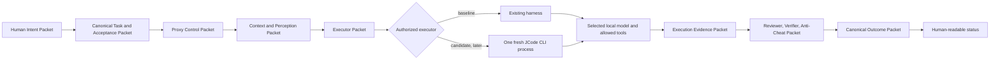
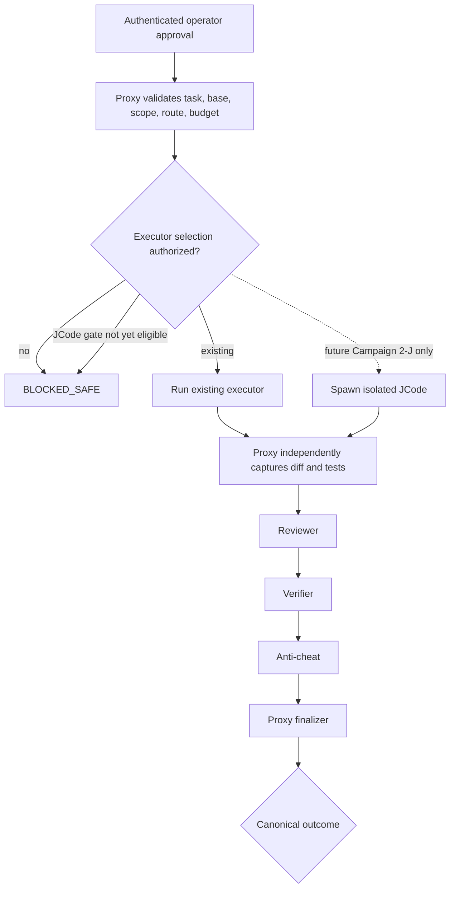
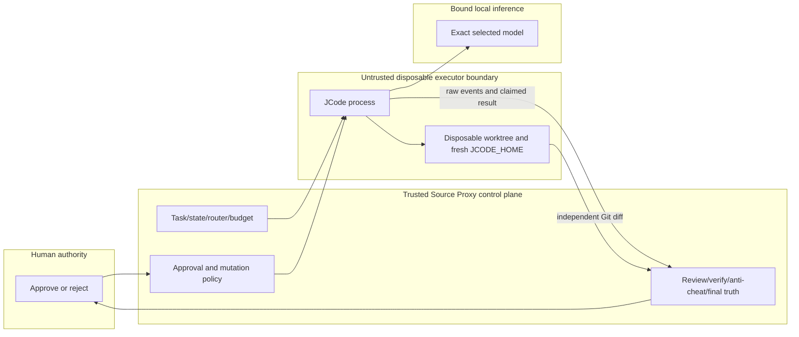
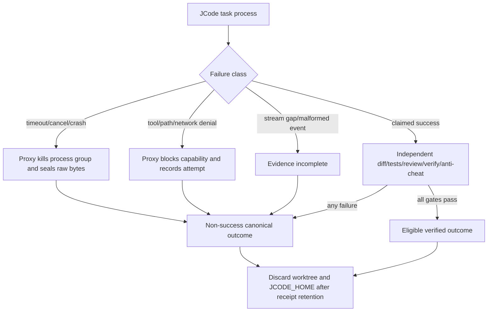

# Human Brain to AI System Brain Layer Map

Status: `PROPOSED FALLBACK MAP`.

`VERIFIED FACT`: the repository has canonical component and campaign documents,
but the minimal Source Proxy context did not reveal one accepted document using
a complete numbered human-to-system layer map. The requested fallback labels
are therefore used without replacing existing names such as canonical context
broker, CodingOrchestrator, CampaignApprovalAuthority, reviewer, verifier, and
anti-cheat.

| Layer | Established concern | Current Source Proxy components |
| --- | --- | --- |
| 0 Human intent and sovereignty | goals, values, approvals, rejection, final authority | human operator; operator assertion ceremony |
| 1 Executive translation | canonical task, scope, acceptance, risk | long-running task request/store; plan and campaign packets |
| 2 Perception and context | repository search, maps, context packets | canonical context broker, Cartographer, Scout, Obsidian, Mac Search |
| 3 Executive control/system orchestration | state, routes, budgets, cancellation, exact outcome | CodingOrchestrator, task store, model router, approval authority |
| 4 Cognitive execution runtimes | bounded coding/model/tool loop | current custom executor; candidate JCode CLI process |
| 5 Model substrate | coder/advisory/verifier models and inference | Qwen 7B primary; Qwen14B/Ornith challengers; Gemma/Hermes advisory; Ollama |
| 6 Motor and tool system | file, shell, tests, worktrees, VCS, network | Proxy tool action executor, target plugins, sandbox/worktree helpers |
| 7 Metacognition and immune system | review, verification, policy, anti-cheat | independent reviewer, verifier, oracle, anti-cheat, path/mutation guards |
| 8 Episodic memory, learning, evidence | traces, receipts, benchmark history | task/evidence stores, participant records, campaign receipts, sealed benchmark |
| 9 Human/system interface | status, approvals, explanations | `/coding` APIs and paused UI projection |

## Data flow

JCode receives only the Executor Packet and permitted context. Hidden verifier
expectations, benchmark solutions, approval internals, unrelated history,
credentials, and previous-task state do not cross the boundary.

## Control flow

The inference path may be `JCode -> loopback inference-only endpoint -> selected
model`. It may never be `JCode -> /coding`, preventing recursive orchestration.

## Trust boundaries

JCode and model output are untrusted proposals. Source Proxy and the human
retain all authority.

## Failure containment

No JCode exception, retry, or self-reported success can bypass the finalizer.
