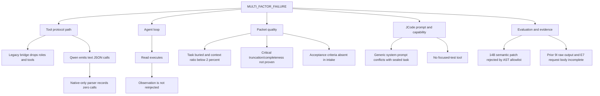

# Root Cause Tree

## Verdict

`MULTI_FACTOR_FAILURE`

No single model defect explains the observations. Both models pass direct
grounding, and both show the intent to read when tools are introduced. The
first controlled failure is a tool-dialect/parser mismatch in Lane B. The first
JCode-specific loss is the legacy bridge dropping roles and schemas. The
baseline loop, full packet, JCode prompt, missing test tool, and one evaluator
also contribute independently.

## Proven Issues

| Priority | Classes | Confidence | Evidence and counterfactual | Correction owner |
| ---: | --- | ---: | --- | --- |
| 1 | `TOOL_SCHEMA_DROPPED`, `PROVIDER_ROLE_TRANSLATION_FAILURE`, `BRIDGE_REQUEST_TRANSFORMATION_FAILURE` | 1.00 | Exact JCode requests contain roles/tools; every legacy D/F backend request does not. Tool-preserving confirmation restores them in all four cells. | Bridge/JCode adapter |
| 2 | `MODEL_TOOL_DIALECT_INCOMPATIBILITY`, `TOOL_CALL_PARSE_FAILURE`, `MODEL_PROFILE_MISCONFIGURATION` | 0.99 | Both B tasks/models and three corrected JCode cells emit read operations as assistant text. Native-only parsers record zero calls. | Model profile/JCode adapter |
| 3 | `AGENT_LOOP_RECOVERY_FAILURE`, `TOOL_RESULT_REINJECTION_FAILURE` | 1.00 | Both C cells parse and execute one valid read, then stop because empty recommended checks return completed. | Proxy agent loop |
| 4 | `PACKET_CONTEXT_BLOAT`, `PACKET_TASK_BURIED`, `CONTEXT_BUDGET_MISALLOCATED` | 0.98 | Minimal packets are about 500 bytes and complete; full packets are 12.6-14.0 KB, below 2% relevant lower bound, and both E cells time out. | Proxy packet builder/campaign design |
| 5 | `PACKET_CONTEXT_TRUNCATION` | 0.90 | Production target slicing is silent at 6,000 characters; E7 service telemetry reports 4,147 to 4,096 token truncation, but its exact request body is the declared gap. | Proxy context builder/model profile |
| 6 | `PACKET_ACCEPTANCE_CRITERIA_MISSING`, `PACKET_TEST_CONTENT_ABSENT` | 0.99 / 0.90 | Intake has no criteria field and emits empty literal requirements; canonical builder requires neither supporting test content nor critical-file completeness. | Proxy task intake/context builder |
| 7 | `JCODE_PROJECT_INSTRUCTION_CONTAMINATION`, `PACKET_INSTRUCTION_CONFLICT` | 1.00 | Exact 2,004-character system prompt says self-modify, use unavailable tools, and commit by default while sealed task forbids them. | JCode adapter/project prompt |
| 8 | `TOOL_SCHEMA_TRANSFORMED_WITH_LOSS` | 1.00 | Task W requires a focused test; JCode exposes read/write/apply only and explicitly has no command tool. | JCode adapter/tool policy |
| 9 | `VERIFIER_EXPECTATION_MISMATCH` | 1.00 | 14B returns a semantically correct `re.sub` implementation; evaluator rejects import and assignment AST nodes without behaviorally testing it. | Diagnostic evaluator/campaign design |
| 10 | `EVIDENCE_INCOMPLETE` | 1.00 | Prior 9I binds only response hash, not raw bytes; E7 binds request hash but lacks exact body. Both gaps are explicit and unreconstructed. | Evidence design |

## Ruled Out or Not Proven

- `RAW_MODEL_CAPABILITY_LIMIT`: ruled out for Task R in both models and Task W
  in 7B; not supported for 14B W because its code is semantically correct.
- `MODEL_GROUNDING_LIMIT`: ruled out by both Lane A Task R passes.
- `PACKET_PATH_MISMATCH`: ruled out in all diagnostics; mounted and shown paths
  match.
- `JCODE_SESSION_OR_DEFAULT_CONTAMINATION`: cross-run contamination ruled out
  by fresh HOME, `JCODE_HOME`, overlay, and session for every run.
- `STREAMED_TOOL_CALL_RECONSTRUCTION_FAILURE`: not reached; provider returned no
  native tool-call fragments.
- `TOOL_AUTHORIZATION_REJECTION_NOT_REINJECTED`: not observed; no call reached
  authorization in failed Qwen tool cells.
- `OUTPUT_BUDGET_INSUFFICIENT`: not supported; failures occur before consuming
  the 1,024-token output allowance.
- Model identity substitution: ruled out by live registry digest checks on all
  24 requests.

## Causal Order

1. Direct inline packets prove the underlying tasks are within model capability.
2. Adding native tools exposes the Qwen text-call/profile mismatch.
3. The alternative Source Proxy action dialect reaches execution but exposes
   the loop reinjection defect.
4. Adding JCode plus the legacy bridge removes roles and schemas before model
   inference.
5. Preserving bridge fields exposes the downstream text-call parser defect.
6. Adding the full Proxy packet causes independent context/latency failure in
   the baseline path.

The next correction must therefore be global and layered: qualify a concise
packet, a Qwen text/native compatibility parser, observation reinjection, and a
complete JCode tool set before comparison runs. The audit tested only the first
bridge layer and does not authorize the remaining changes.
