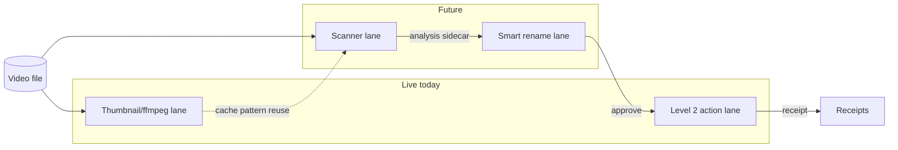

# SpiritFlix Smart Tagging + Smart Rename Plan

## Status

Planning document only.

This document is not implementation approval.

Do not implement scanner, model inference, rename, move, or cache writes until Britton approves a separate implementation prompt.

### Current SpiritFlix admin baseline (as of 2026-06-16)

The following is already implemented and informs this plan:

| Area | State |
|---|---|
| Admin route | `/spiritflix/admin` — unified CasaOS-style file manager (`SpiritFlixAdminApp`) |
| Media root | `/mnt/spirit-8tb/media` via `SPIRITFLIX_MEDIA_ROOT` |
| Level 2 CRUD | Active — preview/confirm/receipt flow in `src/lib/spiritflix/admin/actions.ts` |
| Thumbnails | Real ffmpeg extraction to `.spiritflix-admin/thumbnails/` (`thumbnail.ts`) |
| Metadata sidecars | `.spiritflix-admin/metadata/<hash>.json` with `displayTitle`, `customTags`, `collection`, etc. |
| Receipts | `.spiritflix-admin-receipts/<YYYYMMDD>.jsonl` |
| Path safety | `resolveSpiritFlixAdminPath`, allowlisted roots, symlink/protected-path guards (`paths.ts`, `path-rules.ts`) |

Smart tagging builds on top of this foundation. It does not replace Level 2 actions — it feeds suggestions into them after human approval.

## Lane map

Four lanes. Three exist or are proven today; two are future work. They must never bleed into each other.

| Lane | Status | Mutates media? | Output |
|---|---|---|---|
| **Level 2 action lane** | Live | Yes — after preview + confirm | rename, move, metadata, receipts |
| **Thumbnail/ffmpeg lane** | Live | No | `.spiritflix-admin/thumbnails/` |
| **Scanner lane** | Future | No | `.spiritflix-admin/analysis/` sidecars only |
| **Smart rename lane** | Future | No directly — delegates to Level 2 | human approval → existing Level 2 actions |

```text
Level 2 action lane
→ preview / confirm / receipt rename, move, metadata

Thumbnail/ffmpeg lane
→ already proven local, contained, cache-based

Future scanner lane
→ analysis sidecars only, no rename/move

Future smart rename lane
→ human approval, then existing Level 2 actions
```



**Hard boundaries:**

* Scanner lane never calls rename or move.
* Smart rename lane never writes files directly — it only opens Level 2 preview.
* Thumbnail lane stays separate from analysis frame cache (different roots, different purpose).
* Level 2 remains the sole mutation authority.

## Problem

SpiritFlix has a growing video library. Manual file naming and categorization is slow. Existing filenames may be random, messy, source-specific, or unclear.

Britton wants SpiritFlix to auto-skim videos and suggest:

* smart tags
* categories
* better display titles
* cleaner filenames
* possible folder/collection placement

The system should feel like a private media librarian inside SpiritFlix Admin.

## Product goal

Build a private smart tagging lane for SpiritFlix Admin.

The scanner should:

* sample representative frames/timestamps from a video
* optionally use scene detection
* optionally use OCR/watermark detection
* optionally use local vision-language models or external models if explicitly approved later
* write SpiritFlix-owned analysis sidecars
* show suggestions in the admin UI
* require human approval before applying rename/move
* call existing Level 2 preview/confirm/receipt actions only after approval

## Non-goals

Do not auto-rename files without human approval.

Do not auto-move files without human approval.

Do not edit Jellyfin SQLite.

Do not write analysis files beside videos.

Do not upload private media to cloud models unless Britton explicitly approves a separate cloud lane.

Do not bypass DRM.

Do not download unauthorized media.

Do not create public endpoints.

Do not classify or organize anything that appears underage, coercive, non-consensual, or otherwise unsafe. Such cases must be marked:

```text
needs_review
do_not_rename
do_not_move
do_not_tag_automatically
```

## Safety and privacy rules

The scanner must be private-first.

Default mode:

* local-only
* no cloud upload
* no external API
* no permanent frame export outside SpiritFlix admin cache
* no original media mutation
* no filename changes

All analysis output must be stored under SpiritFlix admin-controlled roots only:

```text
/mnt/spirit-8tb/media/.spiritflix-admin/analysis/
/mnt/spirit-8tb/media/.spiritflix-admin/analysis-cache/
```

Original videos must never be modified by the scanner.

Generated frames/thumbnails must never be written beside original videos.

The scanner must use path containment helpers and allowlisted media roots.

Reuse existing path infrastructure:

* `resolveSpiritFlixAdminPath()` — read access
* `assertWritableSpiritFlixAdminPath()` — write access to admin roots only
* `SPIRITFLIX_ADMIN_PROTECTED_PATHS` — block top-level library folders from move/rename targets
* `computeThumbnailCacheKey()` pattern from `thumbnail.ts` — hash from normalized path + size + mtimeMs

The scanner must reject:

* path traversal
* outside-root paths
* symlink escape
* Jellyfin config paths
* Jellyfin SQLite paths
* repo secrets
* non-video files unless explicitly supported for metadata/OCR

## Proposed architecture

The lane map above is the canonical split. Detail below.

### Scanner lane (future)

Read-only video analysis.

Responsibilities:

* identify video file
* ffprobe duration/codec/size
* sample frames
* detect scenes if available
* run optional OCR/watermark detection
* run optional visual tagger
* produce suggested tags/title/category/filename
* write analysis sidecar
* mark confidence and evidence timestamps

Scanner lane must not rename or move files.

The **thumbnail/ffmpeg lane** (`getOrGenerateAdminVideoThumbnail`) is already proven: local, contained, cache-based. The future scanner sampler reuses its spawn + path + cache-key conventions but writes to `analysis-cache/frames/` and produces multiple samples per video. Thumbnail cache and analysis frame cache stay separate.

### Smart rename lane (future)

Orchestration only. No filesystem writes.

Responsibilities:

* read analysis sidecars
* display suggestions in admin UI
* let Britton approve/edit/reject
* on approval, call Level 2 preview for the chosen action
* never bypass preview/confirm/receipt

### Level 2 action lane (live)

Uses existing guarded CRUD.

Responsibilities:

* display suggestions
* let Britton approve/edit/reject
* call Level 2 rename preview
* call Level 2 move preview
* call Level 2 metadata write preview
* execute only after confirmation
* write receipts

Existing action surface (`SpiritFlixAdminActionName`):

```text
createFolder | rename | move | softDelete | restore | writeMetadata | saveOrder | requestJellyfinRescan
```

Smart tagging integrates with:

* `writeMetadata` — approved tags, display title, collection
* `rename` — approved filename
* `move` — approved folder/category placement

All via existing `preview` → `execute` flow and `SpiritFlixAdminActionDialog`.

## Suggested implementation levels

### Level S1 — Analysis sidecar schema only

Goal:
Create the analysis metadata format and read/write helpers.

No model inference yet.

No ffmpeg frame extraction yet except maybe metadata-only ffprobe in later approved implementation.

Proposed sidecar path:

```text
/mnt/spirit-8tb/media/.spiritflix-admin/analysis/<hash>.json
```

Hash input (mirror metadata sidecar + thumbnail cache key):

* normalized media path
* size
* mtimeMs

Proposed schema:

```ts
interface SpiritFlixSmartAnalysis {
  version: 1;
  videoPath: string;
  pathKey: string;
  fileName: string;
  fileSizeBytes: number;
  mtimeMs: number;
  analyzedAt: string;
  analyzerVersion: string;
  status:
    | "not_analyzed"
    | "analyzing"
    | "needs_review"
    | "suggested"
    | "approved"
    | "rejected"
    | "blocked";
  safety: {
    safeToSuggest: boolean;
    reasons: string[];
    requiresHumanReview: boolean;
  };
  media: {
    durationSeconds?: number;
    width?: number;
    height?: number;
    codec?: string;
    container?: string;
  };
  samples: SpiritFlixSmartSample[];
  suggestedTags: SpiritFlixSmartTag[];
  suggestedCategory?: string;
  suggestedCollections?: string[];
  suggestedDisplayTitle?: string;
  suggestedFilename?: string;
  suggestedTargetFolder?: string;
  confidence: number;
  notes?: string;
}
```

Sample shape:

```ts
interface SpiritFlixSmartSample {
  timestampSeconds: number;
  timestampLabel: string;
  cacheKey?: string;
  observations: string[];
  tags: SpiritFlixSmartTag[];
  confidence: number;
}
```

Tag shape:

```ts
interface SpiritFlixSmartTag {
  id: string;
  label: string;
  group:
    | "format"
    | "source"
    | "performer"
    | "scene"
    | "activity"
    | "position"
    | "style"
    | "quality"
    | "watermark"
    | "safety"
    | "unknown";
  confidence: number;
  evidenceTimestamps: number[];
  reviewRequired: boolean;
}
```

Relationship to existing metadata sidecar (`SpiritFlixAdminMetadataSidecar`):

* Analysis sidecar holds **suggestions** and evidence.
* Metadata sidecar holds **applied** values after approval via `writeMetadata`.
* On approval, copy approved fields into metadata sidecar; mark analysis `status: "approved"`.

### Level S2 — Frame sampler

Goal:
Efficiently skim video without watching the whole thing.

Tools:

* ffprobe for duration (available: `/usr/bin/ffprobe`)
* ffmpeg for frame extraction (available: `/usr/bin/ffmpeg`)
* optional PySceneDetect if installed later (not currently in repo or `package.json`)

Sampling plan:

* for short videos (< 5 min): 6 to 10 frames
* for medium videos (5–30 min): 12 to 24 frames
* for long videos (> 30 min): scene-based samples or capped interval samples
* skip first/last few seconds where possible
* avoid extracting every second
* skip unchanged videos already analyzed (cache key match on path + size + mtime)

Frame cache root:

```text
/mnt/spirit-8tb/media/.spiritflix-admin/analysis-cache/frames/
```

Rules:

* lazy/on-demand
* bounded timeout (follow `FFMPEG_TIMEOUT_MS = 18_000` precedent from `thumbnail.ts`)
* atomic writes (write temp, rename)
* cache key includes path + size + mtime
* `spawn("ffmpeg", args, { shell: false })` — no shell injection
* no writes beside original videos

Reuse thumbnail seek formatting (`formatSeek`) and scale preset (`scale=480:-1`) as starting point; analysis frames may need higher resolution later — gate that behind a separate approval.

### Level S3 — Tagger lane

Goal:
Turn sampled frames into suggested tags.

Potential tagger options to evaluate:

1. Filename/path heuristic tags

   * fast
   * no model
   * can parse source/site/quality/resolution/common naming patterns
   * weak for visual content
   * can run in S1/S3 without GPU

2. OCR/watermark lane

   * detect visible site/studio watermarks
   * helps identify source
   * may already fit with existing face/metadata workflows

3. CLIP-style zero-shot local classifier

   * compare frames against a controlled private tag vocabulary
   * good first local option
   * confidence should be conservative
   * requires explicit model install approval

4. Vision-language model lane

   * possible future local or approved cloud VLM
   * can describe frames and suggest tags
   * must use strict JSON schema
   * must not rename directly

5. Hybrid lane

   * filename heuristic + OCR + sampled frame VLM/CLIP
   * aggregate confidence across timestamps
   * best future target

The plan recommends starting with:

* metadata/filename heuristics
* ffmpeg sampler
* optional local model lane later
* human review UI before action

### Level S4 — Controlled tag vocabulary

Create a controlled private vocabulary.

The tag system should support broad tags first:

```text
solo
duo
group
POV
indoor
outdoor
amateur
professional
compilation
vertical
low-light
watermark
unknown performer
known performer
toy
oral
manual
intercourse
anal
lesbian
cosplay
massage
riding
missionary
doggy
standing
seated
climax
multiple climax
unclear
needs review
```

Important:
Fine-grained explicit tags should use confidence and review.

Do not auto-apply sensitive/uncertain tags.

Each suggested tag needs:

* confidence
* evidence timestamps
* reviewRequired flag

Vocabulary file:

```text
/mnt/spirit-8tb/media/.spiritflix-admin/tag-vocabulary.json
```

Ship a default vocabulary in repo (`src/lib/spiritflix/admin/smart/tag-vocabulary.default.json`) for tests; runtime reads from media root copy Britton can edit.

### Level S5 — Smart title and filename suggestions

The scanner should suggest clean filenames but not apply them automatically.

Proposed display title style:

```text
<Performer or Unknown> — <Short Scene Description>
```

Proposed filename style:

```text
<Performer or Unknown> - <Short Clean Title> - <Primary Tags> - <YYYY-MM-DD or SourceID>.<ext>
```

Rules:

* preserve original extension (matches existing `rename` action behavior)
* sanitize invalid filename characters (reuse `sanitizeName()` from `actions.ts`)
* avoid huge explicit filenames
* avoid overloading names with every tag
* keep original title in sidecar metadata
* store suggested filename separately from actual filename
* require human approval before rename

Example safe patterns:

```text
Unknown - Amateur Indoor Scene - 2026-06-15.mp4
Sava Schultz - POV Toy Scene - 2026-06-15.mkv
Unknown - Compilation - 720p - 2026-06-15.mp4
```

### Level S6 — Review UI in SpiritFlix Admin

Add future admin UI components under:

```text
src/components/spiritflix/admin/smart/
```

Suggested components:

```text
SpiritFlixSmartAnalysisPanel.tsx
SpiritFlixSmartTagList.tsx
SpiritFlixSmartEvidenceStrip.tsx
SpiritFlixSmartActionBar.tsx
```

Add future admin UI:

* Analyze video
* Analyze folder
* View suggested tags
* View evidence frames/timestamps
* Approve tags
* Edit tags
* Reject tags
* Apply suggested title
* Apply suggested rename
* Apply suggested move/category

The UI must show:

```text
Current filename
Suggested filename
Suggested tags
Suggested category
Confidence
Evidence timestamps
Safety status
Approve / Edit / Reject
```

Applying suggestions must call existing Level 2 actions via `/api/spiritflix/admin/actions`:

* `writeMetadata` for approved tags/title
* `rename` for approved filename
* `move` for approved folder/category
* receipts for every action

Wire through existing `SpiritFlixAdminActionDialog` — do not bypass preview/confirm.

### Level S7 — Batch scanning

Batch scanning should come after single-video review works.

Batch mode:

* analyze current folder
* analyze selected files
* skip unchanged files
* rate limit work
* show progress
* allow pause/cancel
* write one receipt/summary per run
* never auto-rename in batch without approval

### Level S8 — Smart categories and folders

Categories should start as metadata only (`collection` field in metadata sidecar).

Future folder moves should be optional and approved.

Examples:

* performer folders
* source/studio folders
* broad categories
* quality buckets
* needs-review folder

Do not move files automatically.

Protected paths (`SPIRITFLIX_ADMIN_PROTECTED_PATHS`) must block suggested moves into top-level library roots without explicit override.

### Level S9 — Integration with Level 2 CRUD

Approved smart rename flow:

```text
analysis sidecar suggestedFilename
→ user clicks Apply rename
→ Level 2 rename preview
→ user confirms
→ Level 2 execute
→ receipt
→ analysis sidecar marks applied
```

Approved smart move flow:

```text
analysis sidecar suggestedTargetFolder
→ user clicks Apply move/category
→ Level 2 move preview
→ user confirms
→ Level 2 execute
→ receipt
→ analysis sidecar marks applied
```

Approved tag flow:

```text
suggestedTags
→ user approves/edits
→ writeMetadata preview
→ confirm
→ receipt
```

## Data storage plan

Proposed roots:

```text
/mnt/spirit-8tb/media/.spiritflix-admin/analysis/
/mnt/spirit-8tb/media/.spiritflix-admin/analysis-cache/
/mnt/spirit-8tb/media/.spiritflix-admin/tag-vocabulary.json
/mnt/spirit-8tb/media/.spiritflix-admin/rename-suggestions/
/mnt/spirit-8tb/media/.spiritflix-admin/analysis/jobs/
```

Existing roots (do not collide):

```text
/mnt/spirit-8tb/media/.spiritflix-admin/metadata/     # applied metadata
/mnt/spirit-8tb/media/.spiritflix-admin/thumbnails/    # viewer thumbnails
/mnt/spirit-8tb/media/.spiritflix-admin-receipts/      # action receipts
/mnt/spirit-8tb/media/.trash/                          # soft delete
```

Add `.spiritflix-admin/analysis` and `.spiritflix-admin/analysis-cache` to `ALLOWLISTED_HIDDEN_ROOTS` in `paths.ts` when implementing S1.

Do not write beside videos.

Do not write inside Jellyfin config.

## API plan

Future routes:

```text
src/app/api/spiritflix/admin/smart/analyze/route.ts
src/app/api/spiritflix/admin/smart/status/route.ts
src/app/api/spiritflix/admin/smart/suggestions/route.ts
src/app/api/spiritflix/admin/smart/vocabulary/route.ts
```

Future lib modules:

```text
src/lib/spiritflix/admin/smart/types.ts
src/lib/spiritflix/admin/smart/analysis.ts
src/lib/spiritflix/admin/smart/sampler.ts
src/lib/spiritflix/admin/smart/tagger.ts
src/lib/spiritflix/admin/smart/vocabulary.ts
```

Initial S1/S2 routes should be conservative.

Suggested actions:

```text
previewAnalysis
startAnalysis
getAnalysis
approveTags
rejectTags
applySuggestedRename
applySuggestedMove
```

`applySuggestedRename` and `applySuggestedMove` are UI orchestration helpers — they must delegate to existing Level 2 preview, not perform filesystem writes directly.

Do not make analysis start automatically on page load.

## Worker model

Avoid doing long analysis directly in a request/response route.

Recommend:

* small one-video metadata-only analysis can be synchronous for ffprobe preview
* longer frame sampling + tagging should use a worker/job queue
* store job state under `.spiritflix-admin/analysis/jobs/`
* expose progress to UI via `status` route
* support cancellation

Node v20.20.2 is available for worker processes. Python 3.12.3 is available if PySceneDetect or OCR lanes need a subprocess later — keep Python optional.

## Model/provider plan

Default:

* no cloud
* no external API
* local-only scanner

Potential local lanes:

* filename/metadata heuristic lane (S3 first)
* OCR/watermark lane
* CLIP-like zero-shot lane
* local VLM if available

Potential future cloud lane:

* only after Britton explicitly approves
* must send only selected sampled frames, not full videos
* must make privacy risk obvious in UI
* must record provider/model in analysis sidecar `analyzerVersion` / `notes`

No vision/ML dependencies exist in `package.json` today.

## Quality and confidence rules

Every suggestion must include confidence.

Confidence bands:

```text
0.90+ high confidence
0.70-0.89 medium confidence
0.40-0.69 weak suggestion
below 0.40 do not suggest unless useful as unknown/needs-review
```

Auto-apply is not allowed in early levels.

Human approval required for:

* explicit tags
* uncertain tags
* performer identity
* rename
* move
* category/folder assignment

## Safety review rules

If any sampled evidence is ambiguous around age/consent/safety:

* do not create explicit tags
* do not suggest rename
* do not suggest category
* mark `needs_review`
* mark `blocked` if severe

The system should never try to "solve" unsafe ambiguity automatically.

Set `safety.safeToSuggest = false` and populate `safety.reasons`.

## Tests required in future implementation

S1 tests (`src/lib/spiritflix/admin/smart/__tests__/`):

* sidecar path is under admin analysis root
* path traversal rejected
* outside root rejected
* schema validates
* unknown fields handled safely
* unchanged file reuses analysis key
* changed file gets new key

S2 tests:

* ffprobe metadata parser
* sampler chooses bounded timestamps
* cache key includes size/mtime
* frame cache path stays under admin cache
* ffmpeg command uses shell false
* timeout handled
* failed extraction returns clean failure

S3 tests:

* tag vocabulary validates
* tag confidence aggregation works
* ambiguous tags marked reviewRequired
* no auto-rename

S6 UI tests:

* Analyze button visible
* suggestions show confidence/evidence
* approve/edit/reject works on metadata only
* Apply rename opens Level 2 rename preview, not direct rename
* Apply move opens Level 2 move preview, not direct move

Follow existing test patterns in `src/lib/spiritflix/admin/__tests__/` and `src/components/spiritflix/admin/__tests__/`.

## Proposed implementation order

Recommend future phases:

1. S1 sidecar schema + vocabulary file + read/write helpers + tests only
2. S2 ffprobe/frame sampler for one selected video
3. S3 heuristic tagger + controlled vocabulary
4. S4 admin review UI (S6 components)
5. S5 local VLM/CLIP experiment, optional
6. S6 approved rename/move integration through Level 2
7. S7 batch folder analysis

## Recommended first implementation prompt after this plan

After Britton approves this plan, the first implementation should be:

```text
SpiritFlix Smart Tagging S1 — sidecar schema, vocabulary file, analysis read/write helpers, no ffmpeg/model inference, no rename/move
```

S1 should not scan real videos yet.

S1 should only create safe foundations.

S1 deliverables:

```text
src/lib/spiritflix/admin/smart/types.ts
src/lib/spiritflix/admin/smart/analysis.ts
src/lib/spiritflix/admin/smart/vocabulary.ts
src/lib/spiritflix/admin/smart/tag-vocabulary.default.json
src/lib/spiritflix/admin/smart/__tests__/analysis.test.ts
src/lib/spiritflix/admin/smart/__tests__/vocabulary.test.ts
```

S1 must update `ALLOWLISTED_HIDDEN_ROOTS` in `paths.ts` to include `analysis` and `analysis-cache` subdirectories.

S1 must not add API routes, UI, ffmpeg calls, or Level 2 action changes.

### S1 implementation note (2026-06-16)

S1 landed as:

```text
src/lib/spiritflix/admin/smart/types.ts
src/lib/spiritflix/admin/smart/vocabulary.ts
src/lib/spiritflix/admin/smart/analysis-paths.ts
src/lib/spiritflix/admin/smart/analysis-store.ts
src/lib/spiritflix/admin/smart/index.ts
src/lib/spiritflix/admin/smart/__tests__/vocabulary.test.ts
src/lib/spiritflix/admin/smart/__tests__/analysis-paths.test.ts
src/lib/spiritflix/admin/smart/__tests__/analysis-store.test.ts
```

Vocabulary is seeded in `vocabulary.ts` (no runtime `tag-vocabulary.json` write in S1). `ALLOWLISTED_HIDDEN_ROOTS` did not need subdir entries because `.spiritflix-admin` is already allowlisted as a hidden root.

### S2 implementation note (2026-06-16)

S2A/S2B landed as scanner-lane library code only (no API route, no UI, no model inference):

```text
src/lib/spiritflix/admin/smart/probe.ts          — ffprobe metadata for one video
src/lib/spiritflix/admin/smart/sampler.ts        — bounded timestamps + ffmpeg frame cache
src/lib/spiritflix/admin/smart/scanner.ts        — scanOneSpiritFlixVideoEvidence orchestrator
src/lib/spiritflix/admin/smart/errors.ts
src/lib/spiritflix/admin/smart/__tests__/probe.test.ts
src/lib/spiritflix/admin/smart/__tests__/sampler.test.ts
src/lib/spiritflix/admin/smart/__tests__/scanner.test.ts
```

Writes stay under `.spiritflix-admin/analysis/` (sidecars) and `.spiritflix-admin/analysis-cache/frames/` (evidence JPEGs). Scanner sets `status: needs_review`, fills `media` + `samples`, leaves `suggestedTags` empty, and never calls Level 2 actions.

### S3 implementation note (2026-06-16)

S3 landed as review-only heuristic suggestions (filename/path/metadata text only — no frame classification):

```text
src/lib/spiritflix/admin/smart/heuristics.ts     — tokenize/normalize/infer broad tags
src/lib/spiritflix/admin/smart/suggestions.ts  — build/apply suggestions + sidecar update
src/lib/spiritflix/admin/smart/__tests__/heuristics.test.ts
src/lib/spiritflix/admin/smart/__tests__/suggestions.test.ts
```

`updateSmartAnalysisWithHeuristicSuggestions()` writes analysis sidecars only. Preserves S2 `media` + `samples`. Sets `needs_review`/`suggested`, never `approved`. No Level 2 calls, no rename/move.

### S4 implementation note (2026-06-16)

S4 landed as admin review UI only (no apply rename/move):

```text
src/app/api/spiritflix/admin/smart/analysis/route.ts
src/lib/spiritflix/admin/smart/review.ts
src/components/spiritflix/admin/SpiritFlixSmartReviewPanel.tsx
src/components/spiritflix/admin/SpiritFlixSmartTagPill.tsx
```

Video card/context menus expose **Smart tags**. Panel reads sidecars via GET; explicit **Analyze / Refresh** triggers S2+S3 pipeline via POST. **Mark reviewed** updates sidecar status only. No Level 2 action imports.

### S5 implementation note (2026-06-16)

S5 adds metadata-only approve/edit/reject inside the Smart tags panel:

```text
src/lib/spiritflix/admin/smart/review-metadata.ts
src/lib/spiritflix/admin/smart/types.ts              — reviewedMetadata on analysis sidecar
src/app/api/spiritflix/admin/smart/analysis/route.ts — action: saveReview
src/components/spiritflix/admin/SpiritFlixSmartReviewPanel.tsx
src/components/spiritflix/admin/SpiritFlixSmartTagPill.tsx
```

`saveReview` stores `reviewedMetadata` (approved/rejected tag ids, edited title/filename/category/collections, notes) in analysis sidecars only. No apply rename/move. No Level 2 calls.

## Environment notes

Observed on Dell/Linux source-server (2026-06-16):

| Tool | Status |
|---|---|
| ffmpeg | `/usr/bin/ffmpeg` — available |
| ffprobe | `/usr/bin/ffprobe` — available |
| Python | 3.12.3 — available (optional for future PySceneDetect/OCR) |
| Node | v20.20.2 — available |

PySceneDetect, CLIP, OCR, and VLM runtimes are not installed and not in `package.json`. Plan any model lane as an explicit future install step.
