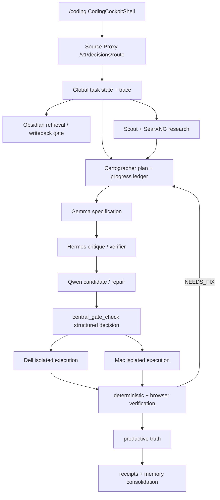

# Minimum Architecture Diagram

```mermaid
flowchart TD
  A["/coding CodingCockpitShell"] --> B["Source Proxy /v1/decisions/route"]
  B --> C["Global task state + trace"]
  C --> D["Obsidian retrieval / writeback gate"]
  C --> E["Cartographer plan + progress ledger"]
  E --> F["Gemma specification"]
  F --> G["Hermes critique / verifier"]
  G --> H["Qwen candidate / repair"]
  H --> I["central_gate_check structured decision"]
  I --> J["Dell isolated execution"]
  I --> K["Mac isolated execution"]
  C --> L["Scout + SearXNG research"]
  J --> M["deterministic + browser verification"]
  K --> M
  L --> E
  M --> N["productive truth"]
  N --> O["receipts + memory consolidation"]
  M -->|NEEDS_FIX| E
```
